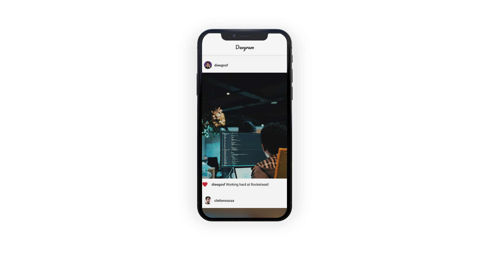

 
 

<i>🚀 Projeto baseado no <a href="https://www.youtube.com/watch?v=2nXsLpUCO20">clone do instagram</a> feito pela <a href="https://github.com/Rocketseat"> Rocketseat</a></i>

Uma rede social para desenvolvedores postarem suas fotos relacionadas ao mundo da tecnologia.

### Como funciona? 💡
Ao acessar o feed, você poderá ver as fotos postadas pelos desenvolvedores. Conforme você scrolla a página, novas postagens são carregadas. O app gera uma pré-visualização da foto (em uma resolução menor e com efeito de blur) enquanto a mesma é carregada. Caso volte para o início do feed e realize um scroll para cima,  as postagens serão atualizadas.

### Tecnologias utilizadas 💙
* ReactNative
* Expo

### Minhas modificações 🔧
* Adicionei a feature de like
* Alterei o StackNavigator no routes.
* Utilizei o Expo.
* Alteração da splash screen.
* Alteração do icon.

### Utilização 🔌
1. Clone este repositório
2. Instale as dependências rodando `yarn install` ou `npm install`
3. Rode o projeto executando `yarn start` ou `npm start`
4. Crie um arquivo .env e configure as variáveis de ambiente seguindo o exemplo do arquivo .env.example.
**Atenção: o ip que você deve utilizar é o que aparece em cima do QRCode do Expo**
5. Suba o json-server executando `yarn json-server --watch ./server.json --host (insira o ip do expo aqui)`
6. Instale o aplicativo do Expo em seu celular [Expo Google Play](https://play.google.com/store/apps/details?id=host.exp.exponent&hl=pt_BR) e digitalize o QR Code.

### Licença 📄
Esse projeto está sob a licença **MIT**.

**Por favor, deixe seu feedback, ele é muito importante para meu crescimento**
**Se gostou, não esqueça de dar uma estrela** 😆
